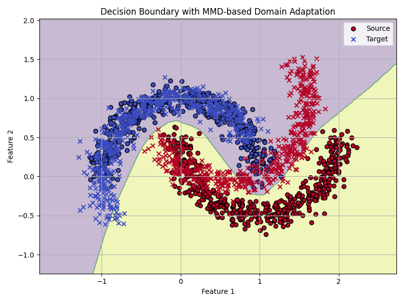
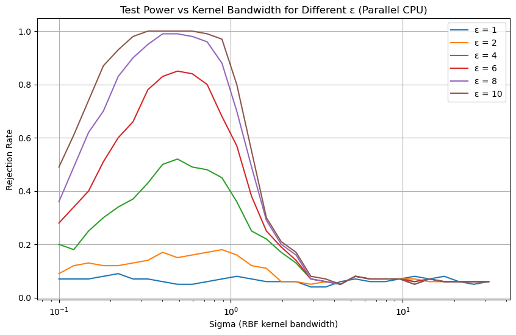
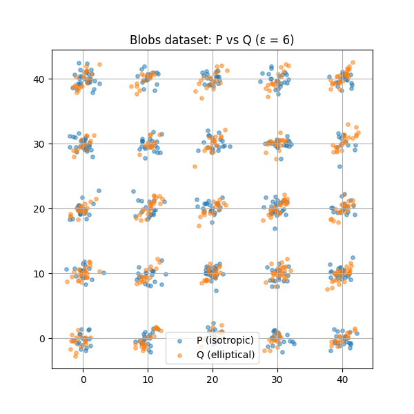

# Maximum Mean Discrepancy (MMD) for Domain Adaptation

## Refrerences Repository:
We implemented the Maximum Mean Discrepancy (MMD) Based on paper from scratch. The original paper can be found at [MMD Paper].
https://github.com/PrathamGupta423/MMD.git

We took inspiration from the following repository:
https://github.com/djsutherland/opt-mmd


Maximum Mean Discrepancy (MMD) is a statistical test used to measure the distance between two probability distributions. In the context of domain adaptation, MMD can be used to align the feature distributions of the source and target domains.
This repository provides an implementation of MMD for domain adaptation using PyTorch.

## Theory
The Maximum Mean Discrepancy (MMD) measures the distance between two probability distributions in a Reproducing Kernel Hilbert Space (RKHS). Given source domain samples $\{x_i\}_{i=1}^n$ and target domain samples $\{y_j\}_{j=1}^m$, the squared MMD is defined as:

$$
\text{MMD}^2(\mathcal{D}_S, \mathcal{D}_T) = \left\| \frac{1}{n} \sum_{i=1}^{n} \phi(x_i) - \frac{1}{m} \sum_{j=1}^{m} \phi(y_j) \right\|_{\mathcal{H}}^2
$$

Using the kernel trick, this can be computed as:

$$
\text{MMD}^2_k(P,Q) := \mathbb{E}_{x,x'}[k(x,x')] + \mathbb{E}_{y,y'}[k(y,y')] - 2\mathbb{E}_{x,y}[k(x,y)]
$$

where $k(\cdot,\cdot)$ is a positive definite kernel function.

The empirical MMD can be estimated using sample distributions:

For samples $X = \{x_1, x_2, \ldots, x_n\}$ and $Y = \{y_1, y_2, \ldots, y_m\}$, we have:

$$
\hat{\text{MMD}}^2(X,Y) = \frac{2}{m(m-1)} \sum_{j \neq i} k(x_i,x_j) + \frac{2}{m(m-1)} \sum_{j \neq i} k(y_i,y_j) - \frac{4}{m^2} \sum_{i,j} k(x_i,y_j)
$$

This leads to the test statistic:

$$
T = \frac{\hat{\text{MMD}}^2(X,Y)}{\sqrt{\hat{V_m}(X,Y)}}
$$

where $\hat{V_m}$ is an unbiased variance estimator of the MMD,


## Results:

The decision boundary learned by the model on source and target domains.



The test power of MMD with respect to different kernel bandwidths:



The synthetic blobs dataset used for experiments:




To create the required environment, run the following command:

```bash
conda env create -f environment.yml
```
To activate the environment, run:

```bash
conda activate mmd
```
To run the code, use the following command:

```bash
python MMD.py
```
